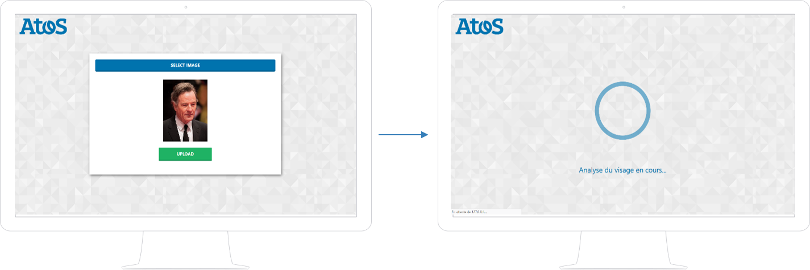
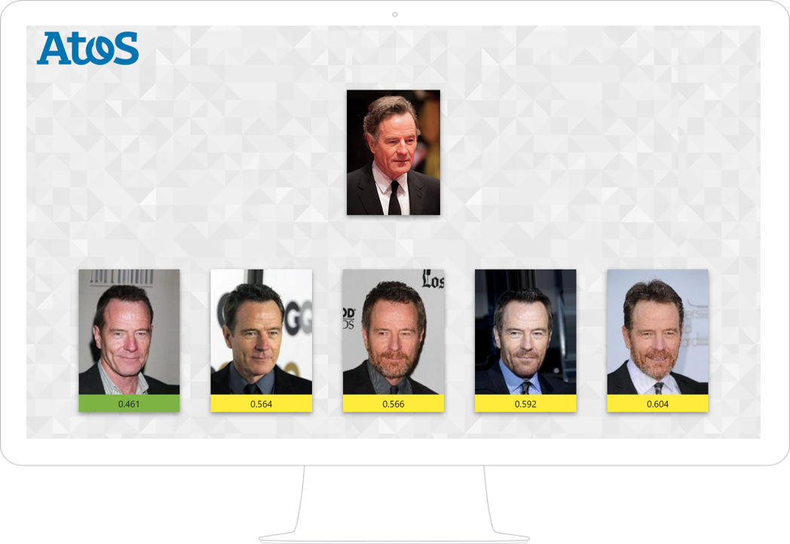

# Flask-facenet

Dependencies are in requirements.txt

You will have to add those files in the root folder : 

- facenet_keras_weights.h5 (download here https://github.com/nyoki-mtl/keras-facenet)
- facenet_keras.h5 (download here https://github.com/nyoki-mtl/keras-facenet)
- features.csv you have do run facenet on your database of images (here we have taken a part of CelebA 
  --> https://www.kaggle.com/jessicali9530/celeba-dataset). In order to do it you can find a code on our notebook 
  notebook/demo-images.ipynb

You have to put your images in the folder : static/img_align_celeba/*here*

Launch app.py

Have fun:  http://127.0.0.1:5000/

